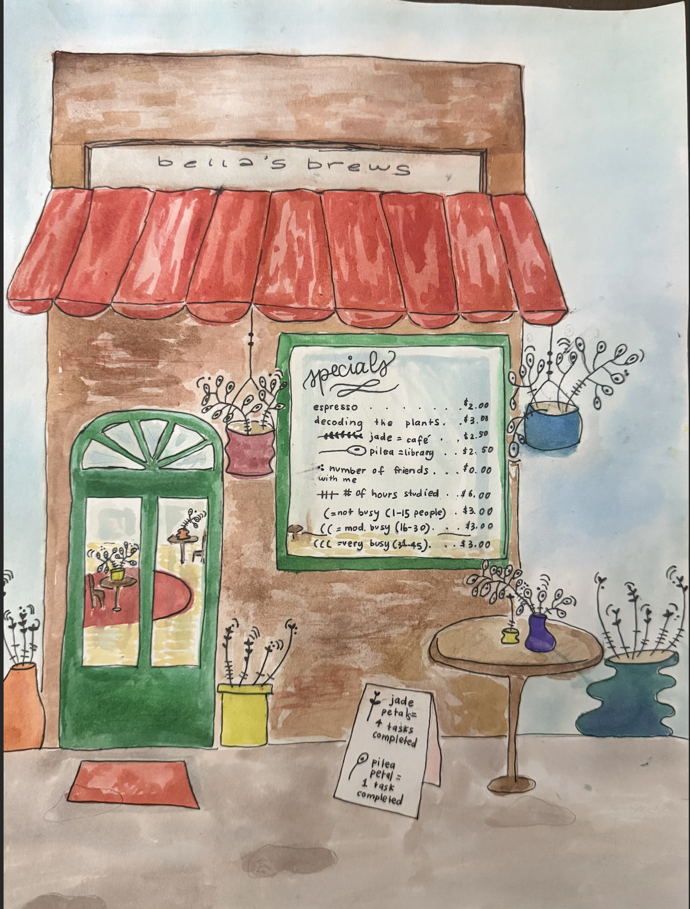

[GitHub Repo](https://github.com/bellakormos/ENVS-193DS_homework-03)

# Homework Set Up

Reading in packages:

```{r}
#| label: packages
#| message: false
library(tidyverse) # load in all packages
library(janitor) # clean column names
library(here) # identifies computer's root folder
library(lubridate) # work with date/time data
library(rstatix) # load rstatix for cliff's delta
library(rcompanion) # also cliff's delta
library(effsize) # add this — contains cliff.delta()
library(showtext)
library(DHARMa)
library(tidyr) # for drop_na
library(knitr) # for kable() to work
library(MuMIn) # for model select
library(ggeffects)


# fonts
font_add_google("EB Garamond", "eb_garamond") # load font "EB Garamond" and save as "eb_garamond"
showtext_auto() # enable show text
showtext_opts(dpi = 200) # change show text size
```

Reading in data:

```{r}
#| label: reading in data
#| message: false
kelp <- read_csv(here("data", "kelp.csv")) # store the data and save object as "kelp" 
my_data <- read_csv(here("data", "official_personal_data.csv")) # read in the personal data as an object named "my_data"
mopl <- read_csv(here("data", "mopl.csv")) # read in mopl data 
```

# Problem 1. Research writing

## a. Transparent statistical methods

In part 1, they used a simple linear regression, as they are testing whether precipitation (a continuous predictor variable predicts the flooded wetland area (a continuous response variable). In part 2, they used a Kruskal-Wallis test, as they are comparing median flooded wetland area across more than two groups (five water year classifications), and the use of the word "median" indicates a non-parametric test was appropriate and applied.

## b. Figure needed

A figure that can could accompany the statement is a by a side-by-side boxplot of wetland flooding area across the five water year classifications. The water year classification (wet, above normal, below normal, dry, and critical drought) should be on the x-axis, and flooded wetland area (m²) should be on the y-axis. Each group can be represented by a vertical boxplot with the middle line being the median. the range of the plot spaninng the 1st and 3rd quartiles (IQR range), and the whiskers extending to 1.5 × IQR. The Kruskal-Wallis test compares medians and is therefore the most important visual component to assess and compare the central tendencies. The raw data points should also be jittered behind the boxplots so that the reader can see the actual data observations and assess the spread and sample size of each group.

## c. Suggestions for rewriting

In part 1, we did not find a significant relationship between precipitation and flooded wetland area in the San Joaquin River Delta (simple linear regression: F(df model, df residual) = test statistic, p = 0.11, α = significance level, adjusted R² = effect size). Additionally, in part 2, we did not find a significant difference in median flooded wetland area across water year classifications (wet, above normal, below normal, dry, and critical drought)(Kruskal-Wallis test: H(df) = test statistic, p = 0.12, α = significance level).

## d. Interpretation

One additional variable that could influence flooded wetland area is the water infrastructure investment (if a land parcel has received funding through wetland incentive programs), which is a binary categorical variable (yes or no). This variable might influence wetland flooding because infrastructure improvements and management may decide to either divert or retain water, controlling whether the wetland is flooded or not, as found by the Suisun Resource Conservation District incentive programs that encouraged landowners to retain flooded wetlands longer into the breeding season.

# Problem 2. Data visualization

## a. Cleaning and summarizing

```{r}
#| label: data cleaning
#| message: false
#| warning: false

# creating new object called 'kelp_clean'
kelp_clean <- kelp %>% 
  clean_names() %>% # clean column names
  filter(site %in% c("IVEE", "NAPL", "CARP")) %>% # filter by site
  filter(!(date == "2000-09-22" & transect == "6" & quad == "40")) %>% 
  # creating a new column called site_name, relabeling species with full name
  mutate(site_name = case_when(
         site == "NAPL" ~ "Naples",
         site == "IVEE" ~ "Isla Vista",
         site == "CARP" ~ "Carpinteria"
)) %>% 
  # convert to factor and set factor level order
  mutate(site_name = as_factor(site_name),
         site_name = fct_relevel(site_name, 
                                 "Naples", "Isla Vista", "Carpinteria")) %>% 
  group_by(site_name, year) %>% # group for summarizing
  summarize(mean_fronds = mean(fronds)) %>% # calculate mean fronds per group
  ungroup() # remove grouping structure
```

## b. Understanding the data

We want to exclude frond observations from the date 2000-09-22 in transect 6 in quad 40 because they are marked to have "-99999" fronds, which does not make biological sense, and therefore represents missing data. It is also outlined in the methods and protocols section that either this data was either not collected or was lost.

## c. Visualize the data

```{r}
#| label: visualization
#| message: false
#| warning: false
# base layer: ggplot using cleaned kelp data-set
ggplot(data = kelp_clean,
       aes(x = year, # set predictor variable
           y = mean_fronds, # set response variable
           color = site_name)) + # differentiate site by color
  # first layer: add plot line and observations
  geom_line() + 
  geom_point() + 
  # label x and y-axes, add title, and change legend title
  scale_color_manual(values = c("Naples" = "#40916C", # Change three groups to customs colors
                                "Isla Vista" = "#CA6702",
                                "Carpinteria" = "#0096C7")) +
  # label axes, add title, add color
  labs(x = "Year", 
       y = "Mean kelp fronds per year",
       title = "Sites vary in mean kelp fronds per year",
       color = "Site") +
  # change theme, set font
  theme_light(base_family = "eb_garamond") +
  theme(plot.title = element_text(hjust = 0.5), # center the title
        panel.border = element_blank()) # no border

```

## d. Interpretation

Isla Vista has the most variable mean kelp fronds per year, as shown by large peaks and valleys. The most notable spikes are around 2008 to nearly 40 fronds, and 2022 dropping down to approximately 0 fronds, producing the widest range of values across the time series and sites.

Carpinteria has the least variable mean kelp fronds per year, as shown by a consistently low and relatively flat line across the study period. The fronds stay between 0 and 15, with no large peaks and valleys in comparison to the other sites.

# Problem 3. Data analysis

```{r}
#| label: cleaning
#| message: false
#| warning: false
# #| include: false
mopl_clean <- mopl |>
  clean_names() |>
    filter(edgedist >= 0) |>  # NOW edgedist exists
  mutate(used_bin = case_when(
    id == "used" ~ 1,
    id == "available" ~ 0    # "available" not "unused"
  )) |>
  select(used_bin, edgedist, vo_nest) # keep only needed columns
# to double check the structure of the data frame
str(mopl_clean) 
 # to display 10 random rows from the data frame
slice_sample(
  mopl_clean,
  n = 10
)
```

```{r}
#| label: visualizing-data
#| message: false
#| warning: false
# #| include: false

# relationship between visual obstruction and nest site use
ggplot(data = mopl_clean,
       aes(x = vo_nest,
           y = used_bin)) +
  geom_point(alpha = 0.5,
             color = "forestgreen") +
  labs(x = "Visual Obstruction at Nest (cm)",
       y = "Nest Site Use (1 = used, 0 = unused)",
       title = "As visual obstruction increases, nest site use decreases")

# relationship between distance to colony edge and nest site use
ggplot(data = mopl_clean,
       aes(x = edgedist,
           y = used_bin)) +
  geom_point(alpha = 0.5,
             color = "steelblue") +
  labs(x = "Distance to Colony Edge (m)",
       y = "Nest Site Use (1 = used, 0 = unused)",
       title = "Relationship between distance to colony edge and nest site use")
```

## a. Response variable

The response variable, nest site use vs non-use is a binary variable. 1 indicates a plover nest was found and monitored there, while 0 indicates an unused site where no plovers were detected and no nests were observed which allows for the anaysis of habitat characteristics.

## b. Purpose of study

*Visual Obstruction:* The visual obstruction at the nest(vo_nest) is a numeric continuous variable, measuring both vegetation height and density as a numeric range of values including fractional units. As visual obstruction increases, the probability of Mountain Plover nest site use would decrease because Mountain Plovers prefer open, bare-ground habitats with little vegetation to detect predators (discussion paragraph 4).

*Distance to prairie dog colony edge* Distance to prairie dog colony edge (edgedist) is a continuous variable, as distance can also take on any value in a range including fractional units. As distance to the prairie dog colony edge increases, the probability of Mountain Plover nest site use would decrease because they engineer suitable plover habitat through, "soil disturbance and vegetation clipping," (Dinsmore et al. 2005, Augustine and Derner 2012, Duchardt et al. 2018)(Introduction, pararaph 3).

## c. Table of models

| Model Number | Visual obstruction | Distance to prairie dog colony   |
|--------------|--------------------|----------------------------------|
| 0            | X                  | X                                |
| 1            | ✔                  | ✔                                |
| 2            | X.                 | ✔                                |
| 3            | ✔                  | X                                |

## d. Run the models
```{r}
#| label: run models
#| message: false
#| warning: false
#| #| include: false

mopl_model0 <- glm(data = mopl_clean, # create a null glm model using cleaned mopl dataset
                   used_bin ~ 1, # response
                   family = "binomial") # use logistic regression glm

mopl_model1 <- glm(data = mopl_clean,  # saturated glm model
                   used_bin ~ edgedist + vo_nest, # response vs. edge distance and visual obstruction
                   family = "binomial") # use logistic regression type glm

mopl_model2 <- glm(data = mopl_clean, # create a glm model using clean mopl data
                   used_bin ~ edgedist, # response vs. edge distance
                   family = "binomial") # use logistic regression type glm

mopl_model3 <- glm(data = mopl_clean, # create a glm model using clean mopl data
                   used_bin ~ vo_nest, # response vs. visual obstruction
                   family = "binomial") # use logistic regression type glm
```

## e. Select the best model
```{r}
model.sel(mopl_model0, mopl_model1, mopl_model2, mopl_model3, rank = AIC) # select the best fitting model based on Akaike's Information Criterion (AIC)
```

The best model as determined by Akaike’s Information Criterion (AIC) is the model using only visual obstruction as a predictor of nest site use (AIC = 322.2), as it has the lowest AIC value of the four candidate models.

## f. Check the diagnostics
```{r}
#| label: check diagnostics
#| message: false
#| warning: false
plot(
  simulateResiduals(mopl_model3) # display the DHARMa diagnostic plots for model 3
)
```
The simulated residuals follow a uniform distribution, as shown visually by the points closely following the red theoretical line in the QQ plot. Additionally, the residuals vs model rank transformed predictions plot shows no obvious patterns, suggesting that all the model assumptions are met. 

## g. Visualize the model predictions
```{r}
#| label: visualize model predictions
#| message: false
#| warning: false

# generate predicted probabilities from the best model 3
mopl_preds <- ggpredict(mopl_model3, # generate predicted probabilities 
                        terms = "vo_nest [0:19 by = 1]") # predict across range of visual obstruction values
# base layer: ggplot using cleaned mopl dataset
ggplot(mopl_clean, 
       aes(x = vo_nest, # set x-axis to visual obstruction
           y = used_bin)) + # set y-axis to binary nest site use
  # first layer: add point observations, edit size, color, and add transparency
  geom_point(size = 3,
             color = "#7B5EA7",
             alpha = 0.25) +
  # second layer: add 95% CI around model predictions
  geom_ribbon(data = mopl_preds,
              aes(x = x,
                  y = predicted,
                  ymin = conf.low,
                  ymax = conf.high),
              alpha = 0.3, # change the transparency of the ribbon
              fill = "seagreen4") + # change the color of the ribbon
  # third layer: add a model predictions line
  geom_line(data = mopl_preds,
            aes(x = x,
                y = predicted),
                color = "#4A3566") + # match ribbon color
   # set y-axis to full probability range
  scale_y_continuous(limits = c(0,1),
                     breaks = c(0,1)) +
  # add axes labels 
  labs(x = "Visual obstruction (cm)",
       y = "Probability of nest site occupancy (1 = Yes, 0 = No)") +
  # change to light theme, change custom font 
  theme_light(base_family = "eb_garamond") +
  theme(panel.grid = element_blank()) # remove gridlines
```

## h. Write a caption for your figure.
**Figure 1. Mountain Plovers show higher probability of nest site occupancy at lower levels of visual obstruction.** The x-axis represents visual obstruction at the nest site in cm, and the y-axis represents the predicted probability of nest site occupancy (0 = unused, 1 = used). Each point represents an individual nest site observation. The black/dark purple line represents the model-predicted probability of nest site occupancy across the range of visual obstruction values. The green ribbon represents the 95% confidence interval around the model predictions. Data citation: Duchardt, Courtney; Beck, Jeffrey; Augustine, David (2020). Data from: Mountain Plover habitat selection and nest survival in relation to weather variability and spatial attributes of Black-tailed Prairie Dog disturbance [Dataset]. Dryad. https://doi.org/10.5061/dryad.ttdz08kt7.

## i. Calculate model predictions
```{r}
#| label: model predictions
#| message: false
#| warning: false

# calculate the predicted probability of nest-site occupancy
ggpredict(mopl_model3, # use best model 3
          terms = "vo_nest [0]") # visual obstruction = 0

```
## j. Interpret your results
The predicted probability of Mountain Plover nest site occupancy at 0 on the index of visual obstruction is 73% (95% CI: 0.65, 0.80). Overall, the selected model shows a negative relationship between visual obstruction and probability of occupancy. As figure 1 shows, as visual obstruction increases, there is also a lower probability of plover nest sites being used with a sharp decrease around 5 cm and higher of obstruction. Biologically, reduced vegetation height and increased exposure of bare ground enhances the Mountain Plover habitat quality. Additionally, sparse vegetation in the range of 3–5 cm also creates ideal plover habitat because the layer of vegetation conceals their body while still allowing them to scan for and detect approaching predators, (Discussion, paragraph 4). 

# Problem 4. Affective and exploratory visualizations

## a. Comparing visualizations

### How are the visualizations different from each other in the way you have represented your data?

In homework 2, I was comparing 2 variables at a time trying to find a correlative relationship. For my affective visualization, the data observations are represented artistically, abstractly, and it is harder to decode the data and find the statistical relationships.

### What similarities do you see between all your visualizations?

In the different categories of my data across all my visualizations, I use different colors/shapes to distinguish the variables. For my categorical visualization, café = gold, library = blue; for my affective visualization, jade plants = café, pilea plants = library; for the study duration vs tasks completed, the tasks completed are in green. There is definitely a creative, colorful component to all visualizations.

### What patterns (e.g. differences in means/counts/proportions/medians, trends through time, relationships between variables) do you see in each visualization?

In the continuous visualization, there is a general positive trend: as study duration increases, so does the tasks completed. In the categorical visualization, the medians of tasks completed between the library vs café in the boxplots are compared, and there is a higher median in library study sessions than the café sessions. In the affective visualization, all variables are presented in the form of houseplants and since all variables are represented, you can extrapolate relationships such as comparing the amount of friends with me or the busyness of the location.

### Are these different between visualizations? If so, why? If not, why not?

The relationships found are all relatively similar, and I am not interpreting the data in different ways across all visualizations.

### What kinds of feedback did you get during week 9 in workshop or from the instructors? How did you implement or try those suggestions? If you tried and kept those suggestions, explain how and why; if not, explain why not.

The feedback I got was that I could find a creative way to put a "code" of my variables so you can read the data observations on a coffee specials sign. I loved this idea, so I put a code of variables on the window as window art and on a sign outside the café in my painting.

## b. Designing an analysis

The appropriate analysis for my personal data is the Mann-Whitney U test.It is appropriate here because my response variable (tasks completed) is numeric and my predictor variable (study location) is categorical with two levels (café and library). Given the small sample size and non-normal distribution (non-centered medians in boxplot), a non-parametric test that compares medians is more appropriate than a t-test.

## c. Check any assumptions and run your analysis

### Check all assumptions

**Check 1: Random Sample** Each data point represents an independently recorded study session, and sessions were not deliberately selected to favor a location, so this assumption is met.

**Check 2: Visual**

```{r}
#| label: histogram-assumption
#| message: false
#| warning: false
my_clean_data <- my_data |> 
  clean_names() # columns names lower case with underscores
# base layer: ggplot using cleaned data-set
ggplot(data = my_clean_data,
       aes(x = tasks_completed, # tasks completed on x-axis
           fill = study_location)) + # fill bars by study location
  # first layer: histogram
  geom_histogram(binwidth = 1,
                 alpha = 0.7, # semi-transparent bars
                 color = "white") + # white outline between bars
  facet_wrap(~study_location) + # separate panel for each location
  scale_x_continuous(breaks = seq(0, 12, by = 1)) + # whole number x-axis ticks
  scale_fill_manual(values = c("Café" = "#FEBC11", # gold for café
                               "Library" = "#4169E1")) + #blue for library
  # Label axes and plot 
  labs(title = "Distribution of Tasks Completed by Study Location", 
       x = "Tasks Completed",
       y = "Number of Study sessions") +
  theme_linedraw() +
  theme(legend.position = "none",
        panel.grid.minor = element_blank(), # remove minor gridlines
        axis.line.x = element_line(color = "black"))
```

Both the café and library distributions are unimodal and right-skewed, indicating similar distributional shape, so all assumptions are met."

### Wilcoxon rank sum exact test

**Summary of stats: median and n values**

```{r}
#| label: summary stats
#| message: false
#| warning: false
my_clean_data %>% 
  group_by(study_location) |> # group by café vs library
  summarize(
    median = median(tasks_completed), # calculate median tasks completed
    n = n() # count number of study sessions per group
  )
```

**Run a Wilcoxon test**

```{r}
#| label: wilcoxon test
#| message: false
#| warning: false
wilcox.test(tasks_completed ~ study_location, # compare tasks completed by study location
            data = my_clean_data) # use cleaned personal data
```

**Calculate effect size using Cliff's Delta**

```{r}
#| label: effect-size
#| message: false
#| warning: false

cliff.delta(tasks_completed ~ study_location,
            data = my_clean_data)
```

I found a small (Cliff’s δ = -0.08) difference in median task completed between cafés (n = 5) and the library(n = 15). (Wilcoxon rank-sum test, W = 103.5, p = 0.72, ⍺ = 0.05). Tasks completed tended to be smaller in cafés (median = 3) than in the library(median = 5).

## d. Create a visualization

```{r}
#| label: mann-whitney-visualization
#| message: false
#| warning: false
#| code-fold: true
# base layer: ggplot using cleaned data-set
ggplot(data = my_clean_data,
       aes(x = study_location, # categorical predictor on x-axis
           y = tasks_completed)) + # response variable on y-axis
  # first layer: boxplot
  geom_boxplot(aes(fill = study_location), # fill boxplot by study location
               width = 0.5,
               outliers = FALSE, # avoid outliers being shown twice
) + # boxplot width
  # second layer: add jittered points
  geom_jitter(width = 0.2, # horizontal spread
              height = 0, # no vertical jitter
              shape = 21) + # open circle points
  scale_fill_manual(values = c(
    "Café" = "#FEBC11", # gold for café
    "Library" = "#4169E1")) + # blue for library
  # add labels for axes and title plot
  labs(x = "Study Location",
       y = "Tasks Completed (n)") +  
  # edit theme, and add grid lines
  theme_minimal() + 
  theme(legend.position = "none", # remove legend
        panel.grid.minor = element_blank(),
        panel.grid.major.x = element_blank(),
        axis.line.x = element_line(color = "black"),
        axis.line.y = element_line(color = "black"))
```

## e. Write a caption

**Figure 2. Distribution of tasks completed by study location across all study sessions (Café vs. Library)** The most recent observation: March 4, 2026. Each circle point represents a study session. The library boxplot (in blue) has higher median (5 tasks), and the café study sessions (in gold) shows a tighter interquartile range and smaller median (3 tasks).

## f. Write about your results

I did not find a significant difference in median tasks completed between café (n = 16, median = 3) and library (n = 15, median = 5) study sessions (Wilcoxon rank-sum test: W = 103.5, p = 0.72, α = 0.05), with a negligible effect size (Cliff's δ = -0.08). Although the library median was larger by 2 tasks, the large p-value and negligible effect size suggest this difference is not meaningful and could be due to random chance. Study location does not appear to have a significant influence on my productivity as measured by tasks completed per session.

## g. Sharing your affective visualization

Attendance of week 10 workshop! 
